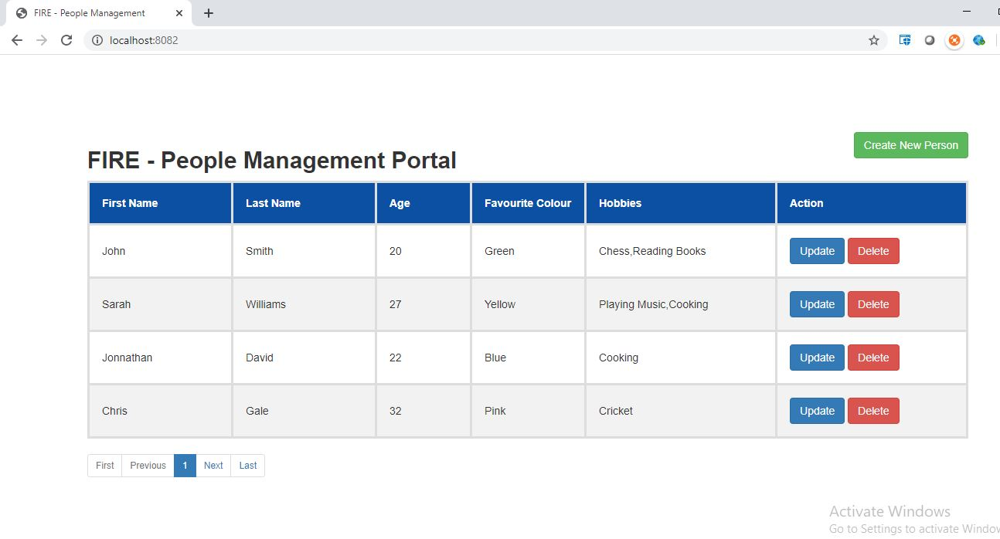
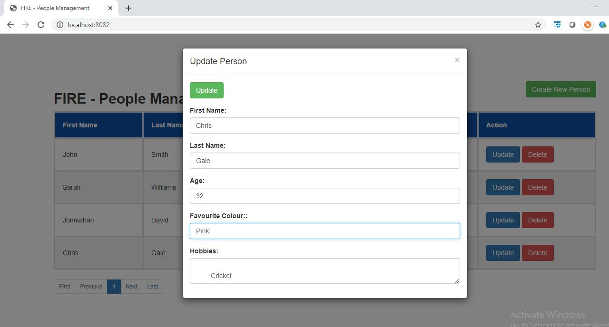

# FIRE- Person Management Portal


Person Management Portal is an Aplication to manage the persons(Basically CRUD Operaitons).

# Demo:
Here you can see few screens,How It Works in GUI.







## How to Run 

This application is packaged as a jar which has Tomcat 8 embedded. No Server required. You run it using the ```java -jar``` command.

* Clone this repository 
* Make sure you are using JDK 1.8 and Maven 3.x
* You can build the project and run the tests by running ```mvn clean install```
* Once successfully built, you can run the application by using below command:
```
        java -jar target/fire-person-rest-0.0.1-SNAPSHOT.jar

```
* That's it! The application can be accessed at `http://localhost:8082/`.

* Alternatively,you can also build and run the application directly using below maven command from project directory.
	
```
        mvn clean install spring-boot:run

```

## About the Application

The application is just a simple person management portal application. It uses an in-memory database (H2) to store the data. You can also do with a relational database like MySQL or Oracle. 

This applicaiton was built using spring-boot as back-end an jquery as front-end.
 
Here is what this application demonstrates: 

- Retrieval of All Person Details.
- Creation of New Person
- Updation of an existing Person Details
- Deletion of a Person.

Here are some endpoints you can call:

### Get information about Person Details.

```
http://localhost:8082/person/v1/allPersons
http://localhost:8082/person/v1/create
http://localhost:8082/person/v1/update/{id}
http://localhost:8082/person/v1/delete/{id}
http://localhost:8082/person/v1/get/{id}
```

### Create a Person resource

```
POST /person/v1/create
Accept: application/json
Content-Type: application/json

  {
            "first_name": "John",
            "last_name": "Smith",
            "age": 20,
            "favourite_colour": "Green",
            "hobby": [
                "Chess",
                "Reading"
            ]
        }

RESPONSE: HTTP 201 (Created)
Location header: http://localhost:8082/person/v1/create
```

### Retrieve list of Persons
```
{
    "person": [
        {
            "id": 1,
            "first_name": "John",
            "last_name": "Smith",
            "age": 20,
            "favourite_colour": "Green",
            "hobby": [
                "Chess",
                "Reading"
            ]
        },
        {
            "id": 2,
            "first_name": "Sarah",
            "last_name": "Williams",
            "age": 27,
            "favourite_colour": "Yellow",
            "hobby": [
                "Playing Music",
                "Cooking"
            ]
        }
    ]
}
```
```
http://localhost:8082/person/v1/allPersons

Response: HTTP 200
Content: paginated list 
```

### Update a person detail

```
PUT /person/v1/update/1
Accept: application/json
Content-Type: application/json

{
            "first_name": "John",
            "last_name": "Smith",
            "age": 20,
            "favourite_colour": "Blue",
            "hobby": [
                "Chess",
                "Reading"
            ]
        }

```


### Remove a person from list

http://localhost:8082/person/v1/delete/1

## Technology Stack:
  
  #Back-End:
- Maven
- Spring Core
- Spring Data (Hibernate,JPA & H2 IN-memory DB)
- Spring boot REST API
- Mockitto,JUNIT(for Test Coverage)

  
 #Front-End:
- HTML
- Bootstrap
- Javascript
- Jquery 


## Test coverage
- Unit test cases(Service Layer) and Intergation test cases(REST API Layer) are covered using Mockitto and JUnit


